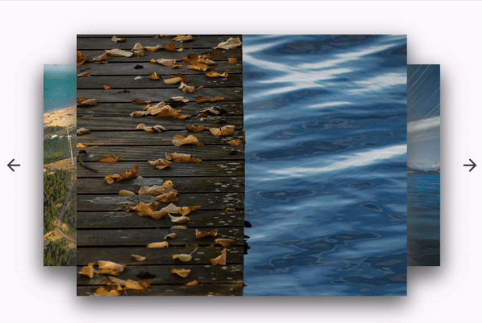

# ThreeDSlider

A 3D slider widget for creating a dynamic, interactive carousel with a 3D effect.

## Supported Platforms

The widget is compatible with the following platforms:
- Flutter Android
- Flutter iOS
- Flutter Web
- Flutter Desktop (macOS, Linux, and Windows)

## Installation

To include **three_d_slider** in your project, add it to your `pubspec.yaml` file:

```yaml
dependencies:
  three_d_slider: ^1.0.0
```

Then, import the package:

```dart
import 'package:three_d_slider/three_d_slider.dart';
```

## Usage

To create a 3D carousel, use the `ThreeDSlider` widget and specify the necessary parameters. Here’s a basic example:

```dart
ThreeDSlider(
  frameHeight: screenHeight * (isWeb ? 0.3 : 0.2),
  frameWidth: screenWidth * (isWeb ? 0.2 : 0.5),
  sideFrameVisibility: 0.2, // Controls the visibility of side frames
  selectedIndex: 2,         // Sets the default selected image index
  frameDecoration: const BoxDecoration(
    boxShadow: [
      BoxShadow(
        color: Color.fromARGB(255, 95, 94, 94),
        offset: Offset(0, 10),
        blurRadius: 20.0,
      ),
    ],
  ),
  cards: imageUrls.map((url) => Image.network(
      url,
      fit: BoxFit.fill,
    )).toList(),
),
```

### Parameters
- **frameHeight**: The height of each card frame.
- **frameWidth**: The width of each card frame.
- **sideFrameVisibility**: Adjusts the transparency of frames on the sides.
- **selectedIndex**: The initially selected card.
- **frameDecoration**: Custom decoration for the frames, e.g., shadow.

In this example, `imageUrls` should be a list of image URLs to display in the carousel.

## Preview

Example of the 3D slider in action:



## License

This project is licensed under the MIT License.